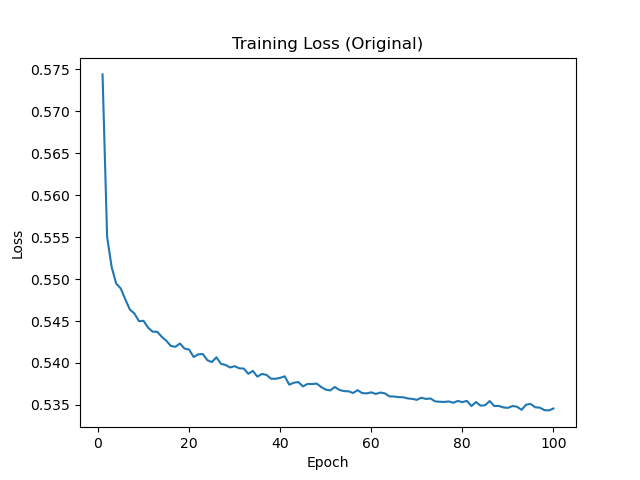
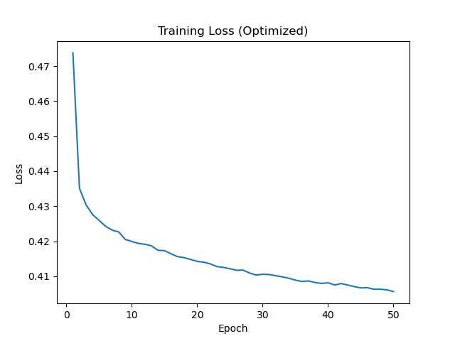
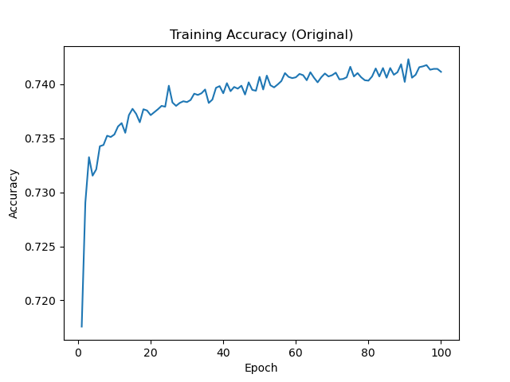
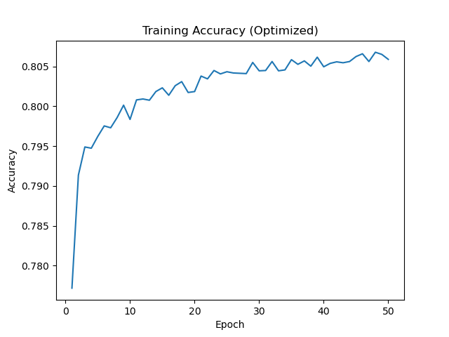

# Module 21 Challenge, 13 November, 2023, Deep Learning and Neural Networks

Development on this project has stopped.

## Table of Contents

- [Description](#description)
- [Usage](#usage)
- [Gallery](#gallery)
- [References](#references)
- [Acknowledgements](#acknowledgements)
- [Author](#author)

## Description

This module simulates a nonprofit, Alphabet Soup, seeking to select funding applicants with the best chance of success. The goal is to produce a deep learning neural network that creates a binary classifier predicting the chance of success. After building the first model, experimentation with the hyperparameters led to an optimized model that boosts the accuracy rate above 75% while reducing the loss below 45%.

A written report summarizes the results.

## Usage

Run the `module-21-neural-network-original-model.ipynb` and the `module-21-neural-network-optimized-model.ipynb`, located in the root of this repo.

## Gallery

Original Model Loss:

Optimized Model Loss:

Original Model Accuracy:

Optimized Model Accuracy:

## References

Dataset provided by IRS. Tax Exempt Organization Search Bulk Data Downloads. `https://www.irs.gov/`

## Acknowledgements

Thanks to Geronimo Perez for feedback and assistance

## Author
Bryan Johns, November, 2023
